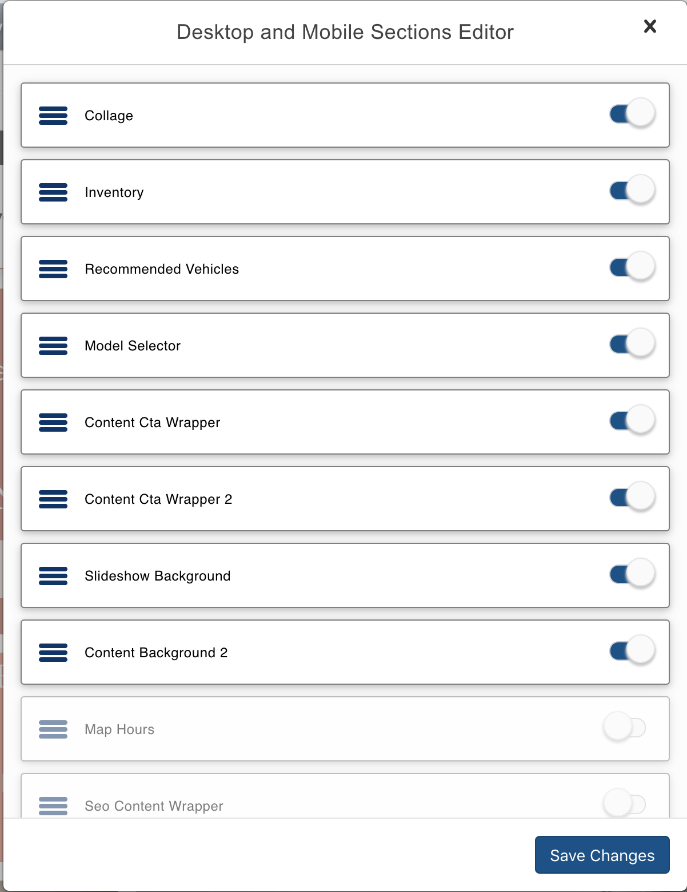
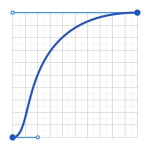

import { Head, Notes, Appear} from 'mdx-deck'

import { Split } from 'mdx-deck/layouts'

import { CodeSurfer } from "mdx-deck-code-surfer";
import dracula from "prism-react-renderer/themes/dracula";

<Head>
  <title>DDC Hackers!</title>
</Head>

## Drag and Drop interfaces using react-beautiful-dnd

#### Deepak Jayaram
#### VT Maple Script

<Notes>
  <ul>
    <li>DND is an amazing type interaction in software - it is expresssive, relatable with human interaction</li>
  </ul>
</Notes>

---

export default Split

---

export default Split

### Group Editor
<ul style={{ listStyle: 'none'}}>
  <li>Editor for moving sections and groups around on a page</li>
</ul>

---

export default Split

<ul style={{padding: "50px", textAlign: "left"}}>
  <li>Higher level abstraction for drag and drop</li>
  <li>Not for everyone - primarily for lists / list of lists / connected lists </li>
</ul>

<Notes>
  <ul>
    <li>Not just a low level api on top of browser api,  providing strong opinions on what the interactions should feel like when you move things around</li>
    <li> Not a lot of emphasis on drag affordances, relies on movement</li>
  </ul>
</Notes>

---

# Features

---

export default Split

### Easy to Style
<ul style={{padding: "50px", textAlign: "left"}}>
    <li style={{paddingBottom: "5px"}}>Natural Drag and Drop animations feel weighted and physical</li>
    <li style={{paddingBottom: "5px"}}>Uses native CSS under the hood to achieve smooth animation</li>
    <li>very minimal restrictions on styling - unopinionated </li>
</ul>

---

export default Split

### Accessible
<ul style={{padding: "50px", textAlign: "left"}}>
    <li style={{paddingBottom: "5px"}}>Ships with support for D&D interactions using only a keyboard</li>
    <li style={{paddingBottom: "5px"}}>Awesome screen reader support (English supported out of the box 📦)</li>
    <li>uses aria attributes for drag interactions, focus and error states</li>
</ul>

---

export default Split

### Easy to use API
<ul style={{padding: "50px", textAlign: "left"}}>
    <li style={{paddingBottom: "5px"}}>Well written and excellent documentation overall</li>
    <li style={{paddingBottom: "5px"}}>Uses render props to eliminate the need for wrapping divs</li>
    <li style={{paddingBottom: "5px"}}>Freedom to choose your own data representation</li>
    <li>Plays well with your favorite state management and middleware libraries</li>
</ul>

---
# API

---

export default Split

### Components
<ul style={{padding: "50px", listStyle: 'none'}}>
  <Appear>
    <li style={{paddingBottom: "10px"}}>DragDropContext</li>
    <li style={{paddingBottom: "10px"}}>Droppable</li>
    <li>Draggable</li>
  </Appear>
</ul>

---

## DragDropContext

---

<CodeSurfer
  code={require("raw-loader!./snippets/dragdropcontext.snippet")}
  title="<DragDropContext>"
  notes="overview"
  theme={dracula}
  showNumbers
  steps={[
    { tokens: {1: [3, 8]}, notes: "import DragDropContext" },
    { ranges: [[4, 7], [9, 12], [14, 17], [19, 25]], notes: "Methods for state, style, and accessibility updates" },
    { range: [19, 25], notes: "This is required for the library to function" },
  ]}
/>

<Notes>
  <ul>
    <li>methods(responders) you can make use of to perform your own state updates, style updates, as well as to make screen reader announcements</li>
  </ul>
</Notes>

---

<CodeSurfer
  code={require("raw-loader!./snippets/onDragEnd.snippet")}
  title="onDragEnd"
  notes="overview"
  theme={dracula}
  showNumbers
  steps={[
    { tokens: {1: [5]}, notes: "provides a result object" },
    { tokens: {2: [4]}, notes: "information about the item" },
    { tokens: {2: [6]}, notes: "information about where the item was picked up from" },
    { tokens: {2: [8]}, notes: "information about where the item was dropped in to" },
  ]}
/>

<Notes>
  <ul>
    <li>This function is extremely important and has an critical role to play in the application lifecycle. This function must result in the synchronous reordering of a list of Draggables</li>
  </ul>
</Notes>

---

## Droppable

---

<CodeSurfer
  code={require("raw-loader!./snippets/droppable.snippet")}
  title="<Droppable>"
  notes="overview"
  theme={dracula}
  showNumbers
  steps={[
    { tokens: {1: [3, 8]}, notes: "import Droppable" },
    { tokens: {3: [4, 5, 6, 7, 8]}, notes: "droppableId is required and needs to be unique" },
    { tokens: {3: [10, 11, 12, 13, 14]}, notes: "a string that can be used to simply accept only the specified class of draggable" },
    { range: [4, 13], notes: "A Droppable utilizes the render props pattern and expects its child to be a function that returns a React component." },
    { tokens: {4: [3]}, lines: [6, 8, 11], notes: "Provided" },
    { tokens: {4: [5]}, lines: [7], notes: "Snapshot:  a small amount of state relating to the current drag state" },
  ]}
/>

<Notes>
  <ul>
    <li>droppableId needs to be unique within the DragDropContext</li>
    <li>One reason the render props pattern is used, is so that react-beautiful-dnd does not need to create any DOM nodes for you. You create your components that where you want to. react-beautiful-dnd latches into your existing structure.</li>
    <li>The provided object has a property called innerRef, which is a function used to supply the DOM node of your component to react-beautiful-dnd.</li>
    <li>A placeholder is a React element that is used to increase the available space in a droppable during a drag when it's needed. The placeholder needs to be added as a child of the component that you designate as the droppable.</li>
    <li>droppableProps are props that need to be applied to the component that you want to designate as your Droppable</li>
    <li>snapshot: isDraggingOver (Is the Droppable being dragged over?), draggingOverWith (What is the id of the draggable that is dragging over the Droppable?)</li>
  </ul>
</Notes>

---

## Draggable

---

<CodeSurfer
  code={require("raw-loader!./snippets/draggable.snippet")}
  title="<Draggable>"
  notes="overview"
  theme={dracula}
  showNumbers
  steps={[
    { tokens: {1: [3, 8]}, notes: "import Draggable" },
    { tokens: {3: [3,4,5,6,7,8,9,10,11,12,13,14]}, notes: "draggableId and Index are required props" },
    { tokens: {4: [3]}, lines: [6, 7, 8], notes: "Provided" },
    { tokens: {4: [5]}, notes: "Snapshot:  a small amount of state relating to the current drag state" },
  ]}
/>

<Notes>
  <ul>
    <li>draggableProps need to be applied to the component that we want to move around in response to a user input</li>
    <li>dragHandleProps need to be applied to the part of the component that we want to use to be able to control the entire component.</li>
    <li>As with our droppable, we also need to provide a ref for our draggable.</li>
  </ul>
</Notes>

---

<h2><a href="https://sharp-keller-12f625.netlify.com/" target="_BLANK">Demo</a></h2>
###### opens in a new tab

---

## Questions? 

---

## Thank you!
